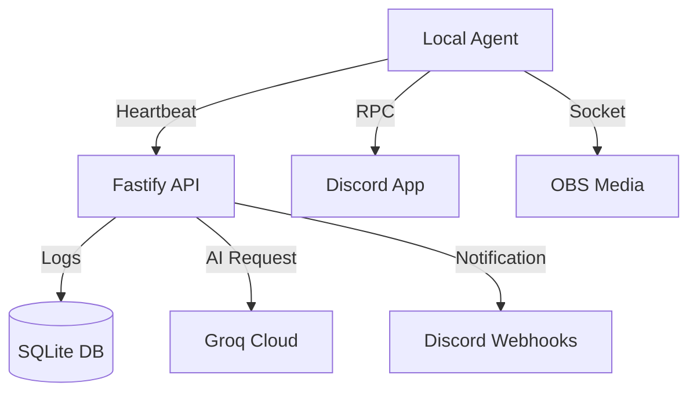

# 🤖 Real Availability
### *The Ultimate AI-Powered Dev Productivity Suite*

<div align="center">


</div>

---

## 🌟 Features Showcase

| 🧠 Intelligence Layer | 📡 Presence & Social | ⚡ Advanced Automation |
| :--- | :--- | :--- |
| **✨ AI Status Summaries**<br>Context-aware messages via **Groq**. | **🎮 Rich Presence (RPC)**<br>Show off VS Code & Git on Discord. | **🛡️ Distraction Blocker**<br>Silences apps during focus/meetings. |
| **🎙️ Meeting Summaries**<br>Transcribe & summarize calls with AI. | **🤖 Auto-Reply Bot**<br>Handles DMs while you're focused. | **🎥 OBS Sync**<br>Auto scene management (BRB/Main). |
| **📊 Daily Standups**<br>Automated daily reports at 7 PM. | **🌐 Who is Free?**<br>Instant team visibility API. | **💧 Health Guard**<br>Smart reminders for hydration & breaks. |
| **🔍 Browser Intel**<br>Categorize work tabs automatically. | | |

---

## � API Reference

| Method | Endpoint | Description |
| :--- | :--- | :--- |
| `POST` | `/status` | Update real-time availability & metadata |
| `GET` | `/status/free` | List all users currently `available` or `coding` |
| `POST` | `/config` | Manage user Discord webhooks & AI tokens |
| `GET` | `/analytics/:id` | Get 7-day productivity breakdown |
| `GET` | `/analytics/heatmap/:id` | GitHub-style focus time data |
| `GET` | `/health` | Check API & Bot connectivity |

---

## ⚙️ Quick Start

### 1. Configure `.env`
```env
PORT=3000
GROQ_API_KEY=gsk_...
DISCORD_WEBHOOK_URL=...
DISCORD_BOT_TOKEN=...
USER_ID=your_id
```

### 2. Launch
```bash
# Install everything
npm install

# Run the ecosystem
npm run server:dev
npm run agent:dev
```

---

## 📂 Architecture


---

<div align="center">
  Built with ❤️ by <b>Hyusband</b>
</div>
